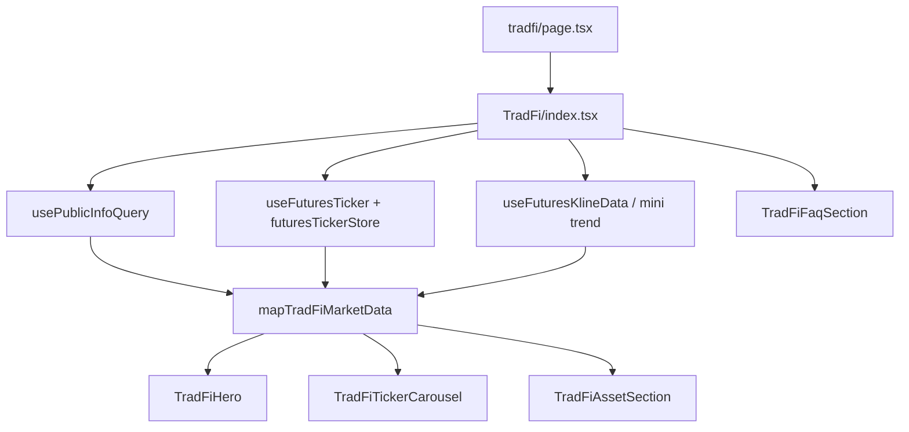

# 02 — 技术方案（Web）

> **状态**：开发基线已确认；路由、数据源、分类、跳转策略已定，`public_info` 样例已确认可支撑配置、列表、分类和跳转。  
> **原则**：主数据源优先复用老的 futures `public_info`、ticker、kline；只有真实样例证明不满足时，才新增 TradFi service。

## 1. 技术原则

- feature-first：TradFi 落地页业务代码集中在 `apps/web/src/apps/TradFi/`。
- 薄路由：`apps/web/src/app/[lang]/...` 只负责 metadata、参数读取和挂载页面组件。
- service-layer：默认不新增请求，先复用 `apps/web/src/services/api/common/public-info.ts`；若真实样例不满足，再新增 `apps/web/src/services/api/tradfi/`。
- React Query 管理接口数据；行情实时态优先复用现有 Futures ticker store / hooks。
- UI 组件依赖 TradFi UI 领域模型，不直接消费后端 DTO。
- 筛选、排序、涨跌颜色、交易链接由纯函数或 hook 统一处理。
- 开发期固定文案先维护 `zh-CN`，多语言范围待确认。

## 2. 路由方案

PRD 写法：顶部导航栏点击 `TradFi` 跳转 TradFi 落地页，但未给具体路径。

已确认路由：

```text
/tradfi
```

预期文件：

```text
apps/web/src/app/[lang]/(with-header)/(with-footer)/tradfi/page.tsx
```

建议新增常量：

```text
apps/web/src/constants/pathnames.ts
TRADFI = '/tradfi'
```

H5 使用同一路由做响应式；除非产品后续明确要求独立移动端路由，否则不另建 `m/tradfi`。

## 3. 顶部导航入口

现有导航入口位于：

```text
apps/web/src/components/layout/Header/PageEntries/helper.tsx
```

当前顺序中可见：

```text
markets → trade → futures → referral → benefitsCenter → feedback
```

PRD 要求：

```text
合约 → TradFi → 预测市场
```

已确认 / 待处理：

- TradFi 是独立一级导航。
- 当前分支未看到 `预测市场` 入口；首版先放在 `futures` 后，后续若补出预测市场入口，再调整到 PRD 顺序。
- `hot` 标签首版作为本次导航入口样式处理。

建议实现：

- 新增 `TRADFI` pathnames 常量。
- 在 `getPageEntries` 中新增一级菜单。
- 固定文案接入 `header.json`，例如 `header:tradFi`。
- hot 标签样式作为导航 item 的可选字段，避免写死在渲染层的特殊分支里。

### 3.1 合约交易下拉 TradFi 入口

PRD 0610 验收第六项额外要求：

```text
【合约交易】下拉 → 新增 TradFi 入口
标题：TradFi
副标题：美股、贵金属、大宗商品，轻松交易
点击：跳转交易页 TradFi 板块 NVDAUSDT，并让下拉弹窗定位到 TradFi tab
```

实现原则：

- 优先复用现有 Header / 合约交易下拉组件，不新增平行导航体系。
- 跳转目标复用 `buildTradFiTradePath` 和默认交易对解析逻辑，不单独手拼 `NVDAUSDT` 路径。
- 点击后用现有 store 状态定位交易页 `TradFi` tab；不新增 path / query 协议。
- 该入口与顶部一级导航职责不同：一级导航进入 `/tradfi` 落地页；合约交易下拉入口直接导流到 TradFi 交易页。

## 4. 目录结构建议

```text
apps/web/src/apps/TradFi/
├── index.tsx
├── common/
│   ├── types.ts                 # UI 领域模型
│   ├── constants.ts             # 默认 symbol、分类 id、布局常量
│   ├── filters.ts               # 分类 / 搜索过滤
│   ├── sort.ts                  # 三态互斥排序
│   ├── format.ts                # 价格、涨跌、标签展示
│   └── routeActions.ts          # TradFi 交易页跳转
├── hooks/
│   ├── useTradFiMarketData.ts   # 聚合 public info + ticker + kline
│   ├── useTradFiTabs.ts         # 标签 tab 生成与选中状态
│   └── useTradFiFaq.ts          # FAQ 单开状态
├── components/
│   ├── TradFiHero.tsx
│   ├── TradFiHeroCta.tsx
│   ├── TradFiTickerCarousel.tsx
│   ├── TradFiTickerCard.tsx
│   ├── TradFiAssetSection.tsx
│   ├── TradFiAssetTabs.tsx
│   ├── TradFiAssetTable.tsx
│   ├── TradFiAdvantageSection.tsx
│   ├── TradFiFaqSection.tsx
│   ├── TradFiMarketSection.tsx
│   ├── TradFiSkeleton.tsx
│   └── TradFiErrorState.tsx
└── __tests__ 或同目录 *.test.ts
```

接口层候选：

```text
apps/web/src/services/api/tradfi/
├── tradfi.ts             # query hooks；API ready 后创建
├── schemas.ts            # API schema
├── mapTradFiMarket.ts    # API/public-info → UI model
└── tradfi.test.ts
```

当前代码反查显示应复用 `usePublicInfoQuery`。可以不新增请求文件，但必须保留 TradFi mapper / selector，避免 UI 直接散落 futures 字段。

## 5. 现有复用候选

| 能力         | 现有位置                                                   | 可复用点                                                                                    | 风险                                                                                |
| ------------ | ---------------------------------------------------------- | ------------------------------------------------------------------------------------------- | ----------------------------------------------------------------------------------- |
| 合约公共信息 | `services/api/common/public-info.ts`                       | `contractList`、`configSectionList`、`sectionIds`、`coinResultVo.icon`、`sort`、`symbolTag` | 当前样例唯一 TradFi section `id=1`，命中 17 个合约；代码仍保留同名 section 合并容错 |
| 合约 ticker  | `apps/Futures/store/futuresTickerStore.ts`                 | `close`、`rose`、`high`、`low`、`amount`                                                    | 必须使用 `subSymbol` 作为 key，不手拼 `NVDAUSDT`                                    |
| ticker 订阅  | `utils/ws/useFuturesTicker`                                | 自动刷新行情                                                                                | 需确认 TradFi 合约是否全部能订阅                                                    |
| 合约迷你走势 | `apps/Markets/components/MarketTable/components/TrendCell` | `useFuturesKlineData(subSymbol.toLowerCase())` + `MiniChart`                                | 数据窗口、涨跌颜色规则需按 UI 确认                                                  |
| 市场表格     | `apps/Markets/components/MarketTable`                      | 分页、搜索、排序、走势、交易按钮                                                            | 当前列多于 PRD；排序字段也多于 PRD，可能需要 TradFi 专用表格                        |
| 合约市场弹层 | `apps/Futures/components/MarketList`                       | section Tab、`symbolTag` 展示、ticker、`contractName` 跳转                                  | 可复用数据思路，不复用 UI 结构                                                      |
| 合约市场页   | `apps/Markets/components/MarketSwap`                       | 从 public info 生成合约列表                                                                 | 需要 TradFi section 过滤                                                            |
| 顶部合约列表 | `Header/PageEntries/FuturesMarketList.tsx`                 | 搜索、ticker、`contractName` 跳转                                                           | UI 结构不等于 TradFi 落地页                                                         |

代码反查后的数据来源判断：

```text
TradFi section:
  public_info.configSectionList[].section
  + contractList[].sectionIds
  + 当前样例唯一 id=1；若出现多个同名 TradFi section，开发期先合并全部 id

TradFi 分类:
  contractList[].symbolTag
  stock   -> 股票
  spot    -> 贵金属
  futures -> 商品

TradFi 行情:
  contractList[].subSymbol
  -> futures ticker close / rose / high / low
  -> futures kline mini trend

TradFi 跳转:
  FUTURES.replace('[symbol]', contractList[].contractName)
```

## 6. 数据流建议



## 7. UI 领域模型草案

> 字段以 API 文档为准。当前只是 UI 侧需要的稳定模型。

```ts
export type TradFiAssetTag = {
  id: string;
  label: string;
};

export type TradFiAsset = {
  id: string;
  symbol: string;
  displaySymbol: string;
  tradeSymbol: string;
  assetName: string;
  tagId: string;
  tagLabel: string;
  iconUrl?: string;
  price: number | null;
  pricePrecision: number;
  change24h: number | null;
  high24h: number | null;
  low24h: number | null;
  trend: number[];
  sort: number;
};

export type TradFiSortState = {
  key?: "price" | "change24h";
  order?: "asc" | "desc";
};
```

## 8. 分类、筛选与排序

分类：

- 默认 Tab 为 `全部`，id 建议 `all`。
- 其余 Tab 来自 API / 后台 TradFi 标签。
- API 若返回空标签，前端只展示 `全部`。
- 后台新增标签时自动展示；删除标签时自动隐藏。

排序：

- 仅 `price` 和 `change24h` 可排序。
- 两个排序字段互斥。
- 点击顺序按 PRD：默认 → 降序 → 升序 → 默认。
- 默认排序恢复 API `sort` 或接口原始顺序。
- 空值始终排到末尾。

搜索：

- PRD 5.2 的搜索交易对被划掉，不进入可交易资产模块。
- PRD 5.5 要求搜索「标签区域的数据」，但 D2 已确认当前阶段不做独立 5.5 行情板块 / 搜索；后续若恢复 5.5，需要重新补搜索字段和 UI 状态。

## 9. 交易跳转

现有合约交易常量：

```text
FUTURES = '/swap/[symbol]'
默认示例：/swap/E-BTC-USDT
```

PRD 示例：

```text
NVDAUSDT
```

代码反查结论：

- 现有 Futures market list 使用 `FUTURES.replace('[symbol]', contractName)` 跳转。
- TradFi CTA、Banner 卡片、资产列表交易按钮、合约交易下拉 TradFi 入口都应复用 `contractName`，不要从 `NVDAUSDT` 手动拼 `/swap/E-NVDA-USDT`。
- `NVDAUSDT` 只作为产品默认交易对语义；真实 path 参数需从 `public_info.contractList` 中匹配后取 `contractName`。
- 当前 `public_info.json` 样例已包含 `NVDAUSDT`，真实 path 参数为 `E-NVDA-USDT`；代码仍保留缺省降级，避免其他环境配置缺失时阻塞页面。

待确认转换：

| 来源                   | 候选目标                                         |
| ---------------------- | ------------------------------------------------ |
| `NVDAUSDT`             | 用于定位默认交易对，不能直接作为 path            |
| `contractName`         | 直接替换 `/swap/[symbol]`                        |
| 交易页 TradFi tab 定位 | 已确认使用现有 store 状态，不走独立 path / query |

建议：

- 统一在 `routeActions.ts` 中实现 `buildTradFiTradePath(asset)`。
- CTA 默认交易对、卡片 / 列表点击和合约交易下拉入口都复用同一方法。
- 可按已确认基线写代码；`NVDAUSDT` 缺失和重复 TradFi section 作为数据配置风险处理。

## 10. Loading / Empty / Error

| 场景         | 处理                                          |
| ------------ | --------------------------------------------- |
| 首屏加载     | 页面 skeleton，不白屏                         |
| 行情未返回   | 对应价格 / 高低 / 涨跌展示 `--`               |
| 迷你走势为空 | 展示空图或占位，不能撑破布局                  |
| 标签为空     | 仅显示 `全部`                                 |
| 列表为空     | 展示空态                                      |
| API 失败     | 展示错误态和重试入口                          |
| WS 断开      | 保留旧数据；按现有 ticker 策略或 API 方案降级 |

## 11. i18n 与 H5

i18n：

- 固定文案进入 `apps/web/src/i18n/locales/zh-CN/tradfi.json` 或合适 namespace。
- Header 新文案进入 `header.json`。
- FAQ 文案先写入 i18n，除非产品确认由后台配置。
- 其他语言范围待确认；不手动补未确认语言。

H5：

- 优先同路由响应式。
- 桌面表格在 H5 上可改为卡片或精简列，具体按 Figma。
- CTA、Banner 卡片、FAQ 行、排序控件必须有稳定尺寸，避免文字溢出或布局跳动。

## 12. 测试建议

纯函数：

- `buildTradFiTabs`
- `filterTradFiAssetsByTag`
- `sortTradFiAssets`
- `formatTradFiPrice`
- `formatTradFiChange`
- `buildTradFiTradePath`

UI / 交互：

- 桌面首屏。
- H5 首屏。
- 分类切换。
- 排序三态。
- FAQ 单开。
- CTA / 卡片 / 交易按钮 / 合约交易下拉入口跳转。
