<title>【待评审】【PR-02265】外部做市商账户工具--合约业务类型--支持配置负手续费率</title>

# 一、变更记录

<table><colgroup><col/><col/><col/><col/></colgroup><tbody><tr><td><b>时间</b></td><td><b>版本号</b></td><td><b>变更人</b></td><td><b>主要变更内容</b></td></tr><tr><td>2026-8-6</td><td>/</td><td><cite type="user" user-id="ou_6e76055c146cbd51e1c0ef8793caef2b" user-name="Lucky"></cite></td><td>创建文档</td></tr><tr><td>2026-8-7</td><td>/</td><td><cite type="user" user-id="ou_6e76055c146cbd51e1c0ef8793caef2b" user-name="Lucky"></cite></td><td>内审会议：https://qfglxo2m3dc.sg.larksuite.com/minutes/obsgajvx487942o8759584v1<br/>与业务侧对齐的会议：https://qfglxo2m3dc.sg.larksuite.com/minutes/obsgakvbl9cgypvw78tq5646</td></tr><tr><td></td><td></td><td></td><td></td></tr></tbody></table>

# 二、评审记录

| **评审时间** | **参与人员** | **结论** |
|-|-|-|
|  |  |  |


# 三、需求背景

因目前对接外部合约做市商，需支持配置负费率以实现返佣；未来可能出现更多类似的外部合作场景，因此本次也一并支持负费率的配置能力。


# 四、需求List

**原型地址：** /

**UI地址：/**

| **模块** | **变更类型** | **说明** |
|-|-|-|
|  |  |  |


---


# 五、产品方案

## **5.1 【优化】【业务类型=合约做市账户】允许 手续费率 字段配置负值** 

**操作路径：**【现货管理后台】--【资产管理】--【做市账户工具】--【外部做市商账号】--【添加】：业务类型=合约做市账户

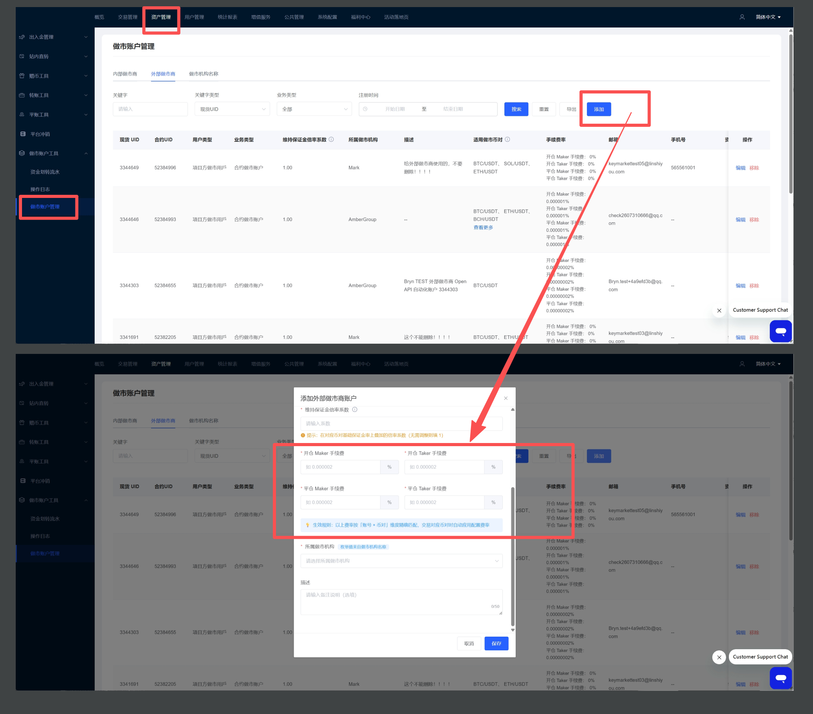

### **现状如下表：**

<table><colgroup><col/><col/><col/><col/></colgroup><thead><tr><th><b>字段名称</b></th><th><b>组件类型</b></th><th>是否必填</th><th><b>说明</b></th></tr></thead><tbody><tr><td>开仓 Maker 手续费</td><td>数值输入框</td><td>是</td><td rowspan="4"><ol><li seq="1"><b>输入框提示语：</b>请输入</li><li><b>固定单位：</b>%</li><li><b>精度：</b>6位（输入超出6位键入无反应）</li><li><b>输入校验：</b><ol><li seq="1">仅支持正数</li><li><b>键入非法内容：</b>自动清空数据，报错提示</li></ol><p>请输入【0，100】之间的数字，精度支持6位</p>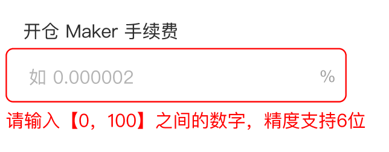</li><li><b>非空校验：</b><ol><li seq="1"><b>触发时机：</b>鼠标失焦 或 点击确定触发</li><li><b>报错提示：</b>对应“必填字段”下 报错提示：请输入</li></ol></li></ol></td></tr><tr><td>开仓 Taker 手续费</td><td>数值输入框</td><td>是</td></tr><tr><td>平仓 Maker 手续费</td><td>数值输入框</td><td>是</td></tr><tr><td>平仓 Taker 手续费</td><td>数值输入框</td><td>是</td></tr></tbody></table>

### **优化后如下表：**

<table><colgroup><col/><col/><col/><col/></colgroup><thead><tr><th><b>字段名称</b></th><th><b>组件类型</b></th><th>是否必填</th><th><b>说明</b></th></tr></thead><tbody><tr><td>开仓 Maker 手续费</td><td>数值输入框</td><td>是</td><td rowspan="4"><ol><li seq="1"><b>输入框提示语：</b>请输入</li><li><b>固定单位：</b>%</li><li><b>精度：</b>6位（输入超出6位键入无反应）</li><li><b>输入校验：</b><ol><li seq="1">支持负数、正数</li><li><b>键入非法内容：</b>自动清空数据，报错提示</li></ol><p>请输入【-100,100】之间的数字，精度支持6位</p>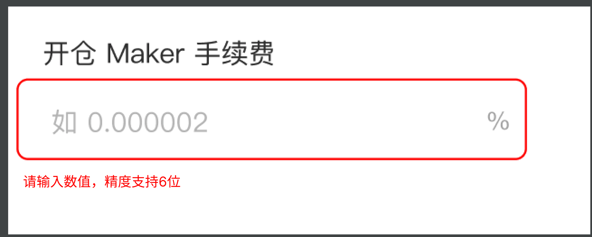</li><li><b>非空校验：</b><ol><li seq="1"><b>触发时机：</b>鼠标失焦 或 点击确定触发</li><li><b>报错提示：</b>对应“必填字段”下 报错提示：请输入</li></ol></li></ol></td></tr><tr><td>开仓 Taker 手续费</td><td>数值输入框</td><td>是</td></tr><tr><td>平仓 Maker 手续费</td><td>数值输入框</td><td>是</td></tr><tr><td>平仓 Taker 手续费</td><td>数值输入框</td><td>是</td></tr><tr><td><b>组件框底部常驻提示文案</b></td><td>--</td><td>--</td><td><ol><li seq="1"><b>在现状基础上新增提示文案：</b>按对应订单类型分别收取，负值表示返佣费率(如-0.000001)</li></ol>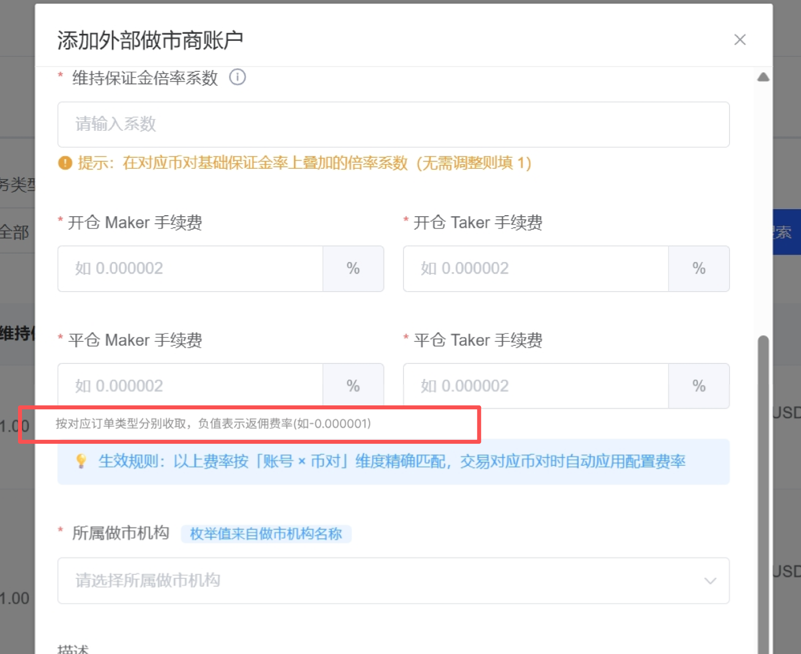</td></tr></tbody></table>


## 5.2 负费率返佣逻辑

<callout emoji="😇">
**同步背景：**费率扣除、计算方式、发放用的流水类型，本次需求没有动（均是现状存在的）
</callout>

1. **返佣出款账户：**底层的 手续费出款账户
2. **出账规则：**【对应做市商账号】触发负费率成交**产生开仓或平仓手续费时**，从该账户扣减对应金额，转入对应的做市商账号合约账户中（同时生成对应流水）
3. **对应做市商账号收款账户：**合约账户
4. **资金流转示意**

```Plain Text
[做市商成交] → 判断该侧费率是否为负
    ├─ 费率配置为正 → 手续费从「做市商账户」扣除 → 转入「平台手续费收入账户」
    └─ 费率配置为负 → 返佣从「手续费出款账户」扣除 → 转入「对应的做市商账号的合约账户」
```


---


## 5.3 前台/后台展示规则（正数化处理）

1. 展示层转换规则

<table><colgroup><col/><col/><col/></colgroup><thead><tr><th><b>场景</b></th><th><b>外部做市商户配置的费率</b></th><th><b>前台h5、app、web展示方式</b></th></tr></thead><tbody><tr><td>手续费流水（正常收费）</td><td>正数</td><td>账单显示："手续费 -12.5 USDT"</td></tr><tr><td>返佣流水（负费率触发）</td><td>负数</td><td><ol><li seq="1">与现有“手续费流水”共用一个流水类型：开仓手续费、平仓手续费</li><li><b>显示eg：</b>开仓手续费：+8.3 USDT</li></ol></td></tr></tbody></table>

1. 【上方第1点展示层转换规则】需要同步处理以下的点

<table><colgroup><col/><col/><col/></colgroup><thead><tr><th><b>产品形态</b></th><th>操作路径</th><th><b>示例图</b></th></tr></thead><tbody><tr><td rowspan="4">前台app、web、h5</td><td>合约账户--资金流水：开仓手续费、平仓手续费</td><td>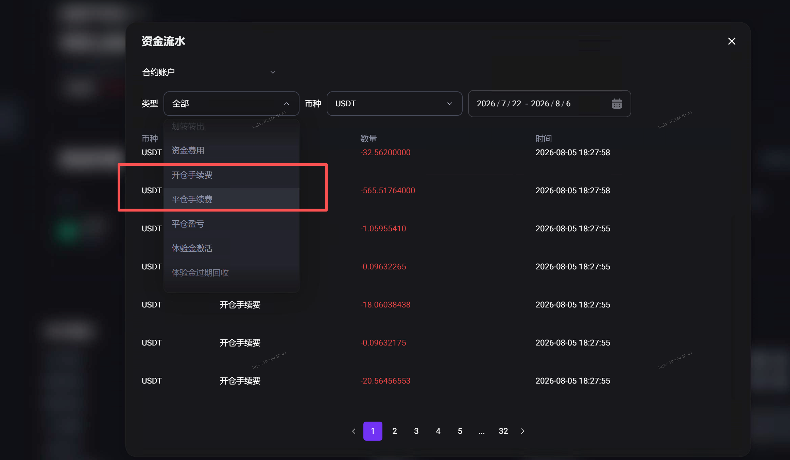</td></tr><tr><td>合约交易--资金流水：开仓手续费、平仓手续费</td><td>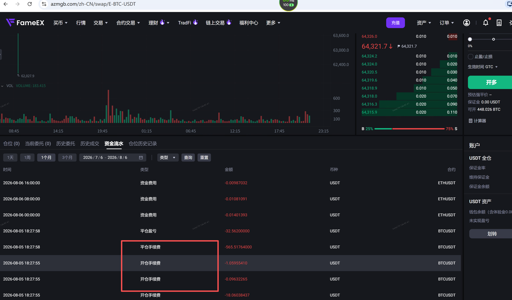</td></tr><tr><td>合约交易--历史成交：手续费</td><td>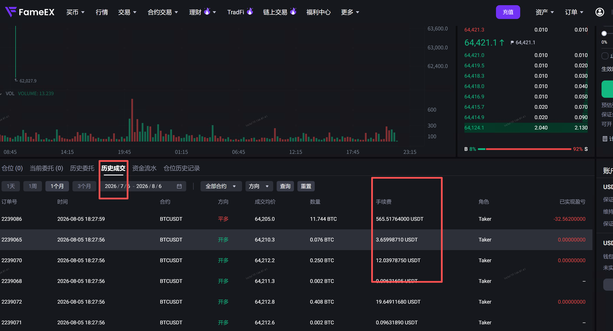</td></tr><tr><td>合约交易--仓位历史记录：手续费</td><td>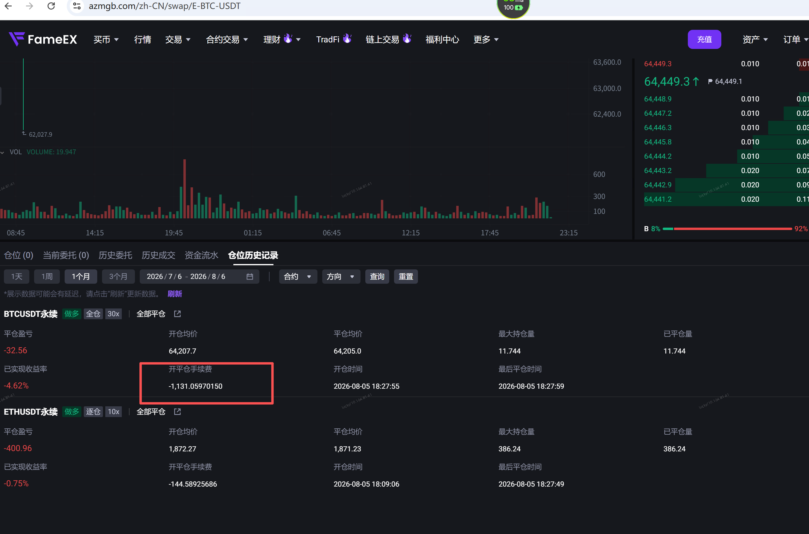</td></tr><tr><td>现货管理后台</td><td>现货管理后台--用户管理：某个用户详情--合约账户--资金流水tab：开仓手续费、平仓手续费</td><td>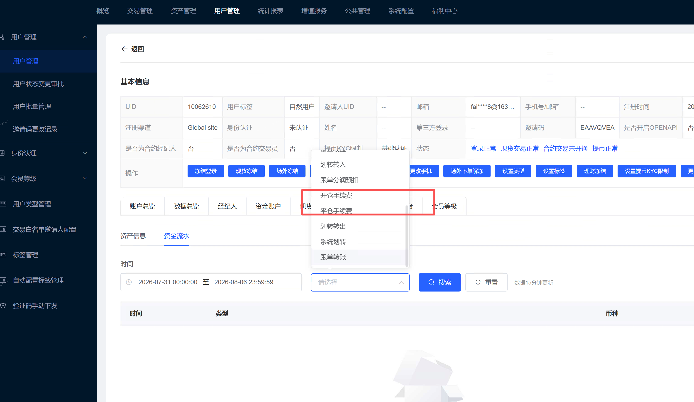</td></tr><tr><td rowspan="5">合约管理后台</td><td>合约管理后台--数据查询--仓位_已平仓：开平仓手续费字段</td><td>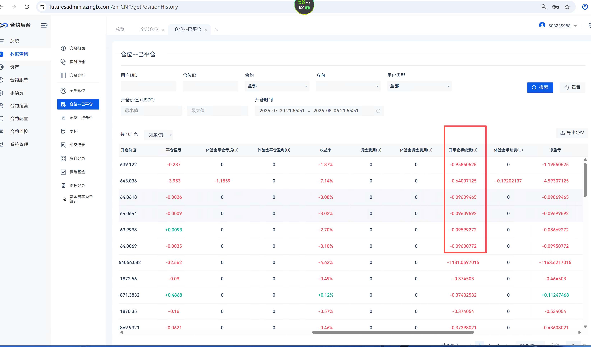</td></tr><tr><td>合约管理后台--数据查询--仓位_持仓中：开平仓手续费字段</td><td>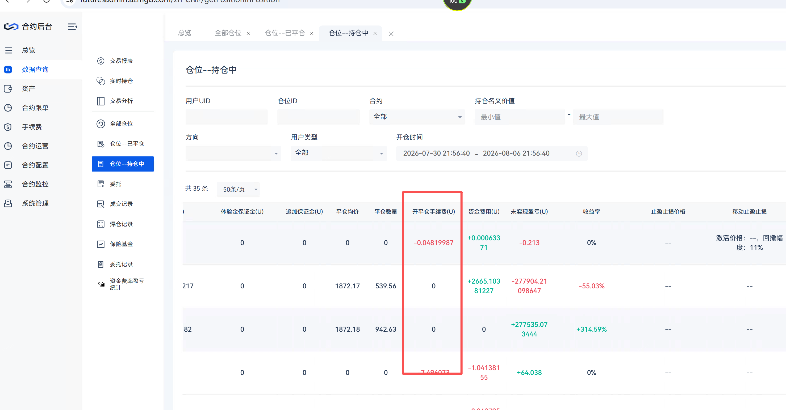</td></tr><tr><td>合约管理后台--数据查询--成交记录：真金手续费</td><td>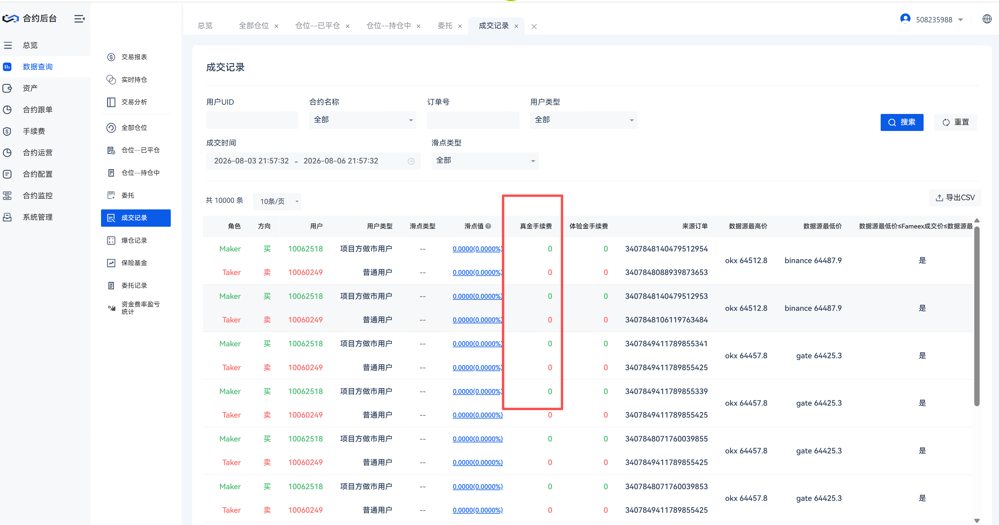</td></tr><tr><td>合约管理后台--手续费--用户级别：贡献手续费</td><td>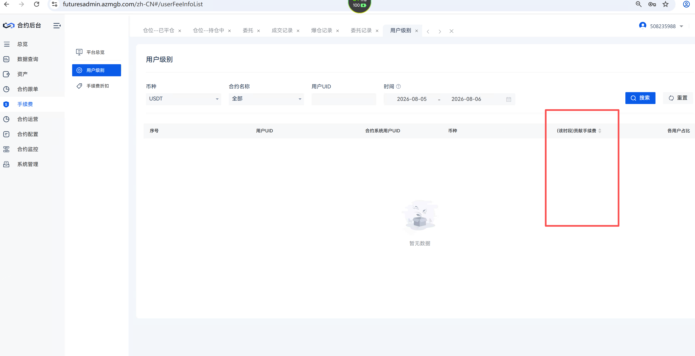</td></tr><tr><td>合约管理后台--资产--流水查询：开仓手续费、平仓手续费</td><td>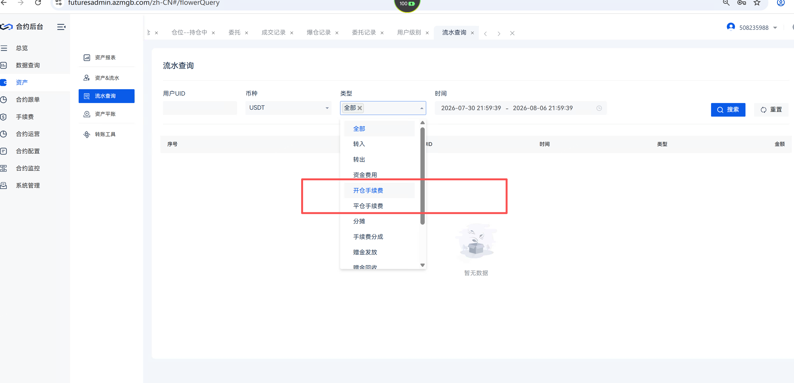</td></tr></tbody></table>


---


## 5.4 异常情况处理

| **异常场景** | **处理建议** |
|-|-|
| 手续费出款账户余额不足 | 不阻断交易本身（做市商正常挂单、成交不受影响），另外这个账户目前可以出现负数么？。。。。 |
| 负费率配置后又改回正数 | 交易时**按当时获取到的的费率计算**，历史已结算的返佣流水**不受后续费率修改影响**，不做追溯调整 |


---


## **5.5 查询**

**操作路径：**【现货管理后台】--【资产管理】--【做市账户工具】--【做市账户管理】--【外部做市商】

1. **下图查询页面：**手续费率字段的值兼容“负的手续费率”显示

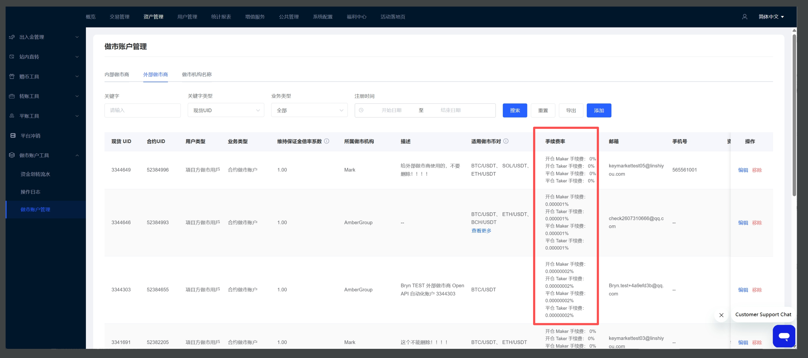


---


## 5.6 以上的总结

1. **核心逻辑（与现有手续费一致，方向相反）**

   - 手续费计算口径、精度、舍入、结算时点等**全部复用现有手续费逻辑**，不新增独立算法。
   - **差异仅在方向：** 
   
     - **正费率**：按 |费率| 从用户的账户**扣除**手续费；
     - **负费率**：按 |费率| 计算返佣，**不扣除、改为新增**，返佣金额**直接计入该做市账户的合约账户余额**。
     - **所以对应的流水是+号：**即"手续费"由"收"变为"加"，其余链路与普通手续费完全一致。
2. **作用范围与口径**

   - **仅业务类型 = 合约做市账户** 支持将手续费率配置为负值。
   - **maker / taker、开仓 / 平仓口径沿用现有已区分的逻辑**，负费率按对应口径生效，无需额外区分设计。
3. **自成交**

   - 外部做市商侧**是否允许自成交保护需要看配置**，核心是taker、maker手续费加总>0，对于交易所就不亏，那么这一点就依据**业务侧同学配置**走就行了
4. **返佣预算上限**

   - 目前没有控制，依据配置的手续费率为准
5. **入账**：返佣按现有手续费结算规则走，直接**新增至该做市账户的合约账户余额内**（与现有手续费入账/扣减为同一链路，方向相反）。
6. **展示（正数化）：**前台 / 后台按 5.3「正数化处理」规则展示返佣（率 / 额不出现负号）


---

---

---


## 5.7 权限

1. 不涉及


## 5.8 埋点

1. 不涉及


## 5.9 核心验收标准

**注：**下方只是产品侧标记的核心验收项，具体验收测试用例**以测试同学产出为准！**

<sheet sheet-id="uwyfAZ" token="OoeSs7l5xhJy4Xtl40mliE0sgPf"></sheet>


---
