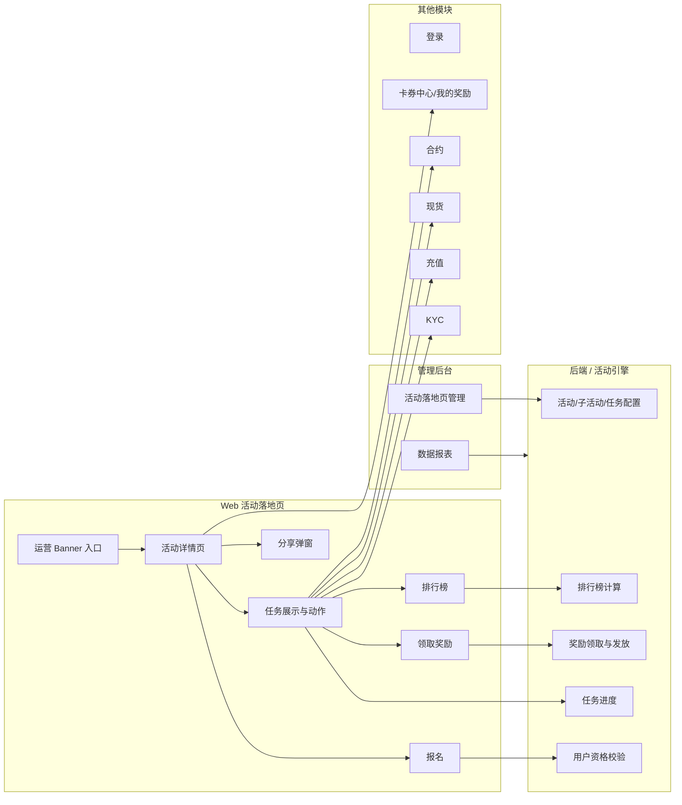

# 06 — 协作与联调

> **归档状态（2026-08-01）**：项目已于 2026-07-30 合入 `online` 并上线，原 `/Users/aven/github/PR-01685-1` worktree 已回收；本文件保留联调结论、历史待决项与验收记录，不对未留证项做事后补写。

## 1. 模块边界

## 2. RACI

| 能力 | Web 前端 | 后端 | 管理后台 | 产品 | 设计 | 数据 |
|------|----------|------|----------|------|------|------|
| 活动详情页 UI | R | C | I | A | A | I |
| 活动配置字段 | C | R | R | A | C | I |
| 活动详情接口 | C | R | I | C | I | I |
| 用户资格校验 | C | R | I | A | I | I |
| 报名活动 | R | R | I | C | I | I |
| 任务进度 | R | R | I | C | I | I |
| 奖励领取 | R | R | I | A | I | I |
| 排行榜 | R | R | I | A | C | I |
| 分享 | R | C | I | A | A | I |
| 埋点与报表 | R | C | I | A | I | R |
| UI 走查 | R | I | I | C | A | I |

R=负责实现，A=最终确认，C=咨询，I=知情。

## 3. 联调前置条件

- [x] Web 路由确认：`/campaign/[activityId]`。
- [x] YApi 当前版本已整理，覆盖活动详情、报名、刷新/进度、领取、我的记录、排行榜。
- [x] YApi 2026-06-26 已从 cat_1205 同步最新接口定义；原始导出见 `inbox/yapi-sync/`。
- [x] `feature/PR-01685-1` 代码/Mock 与 YApi 2026-06-26 差异已校准（见 `03-api-contract.md` §0.5）。
- [ ] 后端测试活动配置完成，至少包含五种任务类型。
- [ ] 测试账号准备：暂无；自动验收前由 Lark 机器人向负责人索取。
- [x] Figma MCP 已读取组件画板与整页浅/深色规格，见 `07-figma-spec.md`。
- [x] 埋点事件表已导出为 Markdown，并整理前端事件与公共参数。

## 3.1 Lark CLI PRD 与评论补录

- 最新 PRD 来源：`inbox/lark-sync/activity-landing-page-prd.md`（通过 Lark CLI 只读同步）。
- 旧手动导出 PRD 已删除；后续不再读取 `inbox/activity-landing-page/` 下的 PRD Markdown。
- 历史 0616 手动导出版曾与原 PRD 对比：正文行数一致；归一化 Lark 图片 authcode 后无正文差异。该记录仅保留为历史说明，不再作为读取来源。
- 评论补录（截图来源：2026-06-16 用户提供）：倒计时不需要 WebSocket，服务端只需返回时间戳，客户端本地按时间计算未开始 / 进行中 / 已结束和倒计时展示。
- 处理结论：评论优先级高于 PRD 旧行文中“WebSocket 实时/定时轮询”的泛化描述；Banner 倒计时、自动开启、自动结束按“服务端时间戳 + 客户端本地 tick”实现，不接 WebSocket。
- 保留待确认：任务进度、排行榜、活动配置变化是否需要 WebSocket 仍按 YApi / 后端最终接口确认；若无 WebSocket，则使用 `refresh` / `progress` / `ranking` + 30s 轮询 / 手动刷新。

## 4. 联调检查表

### 4.1 活动详情

- [ ] 匿名用户可访问活动页。
- [ ] 活动头图、标题、副标题、时间、规则正确。
- [ ] 未开始、进行中、已结束状态正确。
- [ ] 已下线活动按 PRD 显示“已结束”或后端指定错误态。
- [ ] 限制用户进入后弹强拦截弹窗，无法关闭，点击返回上一页。

### 4.2 报名

- [ ] 未登录点击“立即参与”跳登录并携带 from。
- [ ] 进行中活动报名成功，toast “已报名成功”。
- [ ] 已报名用户按钮展示“已参与”置灰。
- [ ] 未开始活动按钮“未开始”置灰。
- [ ] 已结束活动按钮“已结束”置灰。
- [ ] KYC 前置失败 toast 正确。

### 4.3 任务

- [ ] 单一任务展示奖励、条件、进度、按钮状态。
- [ ] 组合任务 AND 完成所有条件后可领取。
- [ ] 组合任务 OR 完成任意条件后可领取。
- [ ] 阶梯任务达成高档后按最高档领取，不叠加。
- [ ] 进阶任务逐档领取，可叠加。
- [ ] KYC 条件不展示进度条。
- [ ] 数值条件展示当前值 / 目标值 / 进度条。
- [ ] 未报名点击任务按钮提示先报名。
- [ ] 去完成按钮跳转 KYC、充值、现货、合约路径正确。

### 4.4 领取

- [ ] 可领取状态点击调用领取接口。
- [ ] 领取中按钮 disabled，避免重复提交。
- [ ] 领取成功后状态刷新为已领取 / 待发放 / 已发放。
- [ ] 重复领取展示“奖励已领取”。
- [ ] 超时展示“领取请求已提交，请稍后在卡券中心中查看”。
- [ ] 失败后按钮状态不变，可再次点击。

### 4.5 排行榜

- [ ] 我的排名：未报名 / 未上榜展示 `-`。
- [ ] 1000 名以上展示 `1000+`。
- [ ] 排名指标值千分位，保留 2 位小数。
- [ ] 前 3 名展示奖牌。
- [ ] UID 脱敏展示。
- [ ] 分页每页 10 条，前五页和最后一页。
- [ ] 暂无数据空态正确。
- [ ] 最近更新时间和更新频率正确。

### 4.6 分享 / 规则 / 底部浮层

- [ ] 点击分享打开 Web 分享弹窗。
- [ ] 复制链接成功 toast 正确。
- [ ] WhatsApp / X / Telegram 链接可打开。
- [ ] 分享链接包含 activityId、utm_campaign、inviteCode。
- [ ] 点击“我的奖励”跳转正确。
- [ ] 点击“活动规则”平滑滚动到底部规则区。
- [ ] 页面下滑顶部 CTA 不可见时底部浮层展示，回到顶部隐藏。

### 4.7 Browser / Playwright 自动验收

- [x] Browser / Playwright 完成桌面 active 首屏 UI 还原修复实测；历史截图已按公共规则清理。
- [ ] Browser MCP 完成桌面浅色实测报告，对照 Figma `9517:137713`。
- [ ] Browser MCP 完成桌面深色实测报告，对照 Figma `9364:134676`。
- [x] Browser / Playwright 完成 390px H5 UI 还原修复实测，页面顶部无遮挡、CTA / 分享按钮布局正常；历史截图已按公共规则清理。
- [ ] Playwright MCP 跑通未登录、报名、未报名任务提示、KYC 前置失败。
- [ ] Playwright MCP 跑通任务去完成、领取、领取超时、重复领取、接口失败。
- [ ] Playwright MCP 跑通排行榜分页、空态、`1000+`、UID 脱敏。
- [x] Playwright 覆盖活动规则锚点和分享弹窗；历史截图已按公共规则清理；复制 toast、渠道真实跳转、底部浮层仍待全量验收。
- [ ] 自动验收发现的不符 PRD / Figma / API 契约问题与 bug 已全部修复并重跑通过。

### 4.8 95% UI 还原专项结论

**2026-07-07 更新**：桌面 light + dark 与 390px H5 的 L2 Figma 并排验收已完成，**JF1–JF10、K12 全部 pass、无残留偏差**，UI 视觉验收（L2）闭环，可声明 UI 达到 95% 还原（报告见 [`evidence/ui-ux/2026-07-07/README.md`](../evidence/ui-ux/2026-07-07/README.md)）。

历史背景（下述为 2026-07-07 之前状态）：现有实现主要按项目通用 token 近似 Figma，历史 Playwright 实测只能证明局部页面可用和部分遮挡问题已修复。

为达到 95%，后续执行策略已写入：

1. 公共规则：`../../../common/rules/ui-style-token-rules.md` 的“高保真视觉例外”。
2. 项目规则：`../engineering/development-rules.md` 的“95% UI 还原专项策略”。
3. 前端任务：`04-frontend-tasks.md` 的 `JF. 95% UI 还原专项` 与 `K12`。

需要设计 / 产品确认或接受的事项：

| 项 | 当前判断 | 影响 | 状态 |
|----|----------|------|------|
| Figma 验收基准 | 浅色 `9517:137713`、深色 `9364:134676`、组件画板 `3068:7` | 决定截图对照基准 | ✅ 已确认为验收基准（2026-07-07 并排采用） |
| H5 高保真基准 | 移动端按 390px 与整页帧 H5 表现并排 | 影响移动端是否能按 95% 量化 | ✅ 已完成 390px 并排（JF8 通过） |
| 允许局部精确值 | 为 95% 还原必须允许尺寸 / 间距 / 圆角精确值 | 与普通 token 近似策略不同 | 已写入规则，已执行 |
| 剩余偏差接受机制 | 所有保留偏差必须由设计 / 产品确认 | 避免静默降级 | ✅ L2 无残留偏差，无待确认项 |

## 5. 测试账号需求

| 账号类型 | 数量 | 用途 |
|----------|------|------|
| 未登录用户 | 1 | 登录引导 |
| 未报名用户 | 1 | 报名流程、任务前置提示 |
| 已报名用户 A | 1 | 完成部分任务，进度展示 |
| 已报名用户 B | 1 | 全部任务完成，领取流程 |
| 未完成 KYC 用户 | 1 | KYC 前置失败 |
| 限定用户外用户 | 1 | 强拦截弹窗 |
| 受限地区 / 黑名单用户 | 1 | 强拦截弹窗 |
| 排行榜上榜用户 | 1 | 我的排名与榜单展示 |

## 6. 风险与缓解

| 风险 | 影响 | 缓解 |
|------|------|------|
| YApi 与当前 Mock/service 不一致 | 服务层和 mapper 返工 | 先输出差异清单，再按 YApi / 后端最终口径校准 |
| Mock 数据与 YApi 文档不一致 | Mock 联调误导真实联调 | Mock 与真实 API 共用 schema / mapper，切真实接口前校准 |
| 任务类型多，字段复杂 | UI 与状态分支膨胀 | mapper + UI 领域模型 + `TaskRenderer` 分发 |
| 派生状态散落组件 | 难维护、易错 | 按 `calc.ts` 纯函数集中计算 |
| WebSocket 未落地 | 任务进度 / 排名实时性不足 | Banner 倒计时已由评论确认不需要 WebSocket；任务/排名按 YApi refresh/progress/ranking 先做轮询/手动刷新，WebSocket 待后端确认 |
| 分享 UI 未确认 | 分享入口和弹窗可能返工 | 文档阶段只记录数据需求，UI 开发前再按 Figma 确认 |
| UI 持续变更 | 返工 | 每次变更更新截图索引和任务清单 |
| 活动规则富文本格式未知 | 渲染风险 | 后端确认纯文本 / HTML / Markdown；HTML 需安全处理 |
| 跳转路径不一致 | 用户无法完成任务 | Cursor AI 开发时分析项目现有 KYC/充值/现货/合约/卡券中心逻辑并沿用 |
| Web 埋点枚举 / SDK 未确认 | 上报字段可能返工 | Cursor AI 开发时分析项目现有埋点 SDK、`device_id`、`page_source` 并沿用 |
| 自动验收未闭环 | PRD 偏差和交互 bug 遗留 | Browser / Playwright MCP 发现问题必须修复并重跑 |

## 7. 待决问题（Open Questions）

> **本表是 PR-01685 全部待确认 / 待决项的唯一登记来源。** README、00-feature-inventory、03-api-contract 等文档只引用本表，不再各自维护。
> API 字段级明细仍以 [03-api-contract §0.4 / §10](./03-api-contract.md#04-仍需后端确认) 为依据，本表登记其状态与负责人。
> 状态：✅ 已确认 / 🔴 切真实接口前必须关闭 / 🟡 开发时沿用现有项目逻辑 / ⚪ UI/验收前确认。

### 7.1 后端契约（切真实接口前关闭）

| ID | 问题 | Owner | 状态 |
|----|------|-------|------|
| B1 | YApi 成功 `code` 值（`"0"` 还是其它 Success code） | 后端 | ✅ YApi 2026-06-26：`code="0"` + `succ=true` |
| B2 | 实际网关前缀（当前 service 用 `/fe-ex-api/api/activity`） | 后端 | ✅ 与项目现有 `fe-ex-api` Growth 接口一致；`campaign.ts` 已沿用，联调环境实测通过前登记为已对齐 |
| B3 | 是否返回 `serverTime`；若无，倒计时按客户端时间解析有偏差风险 | 后端 | ✅ 详情接口返回 `serverTime` 毫秒时间戳 |
| B4 | `displayStartTime/displayEndTime` 与 `startTime/endTime` 的展示与可参与边界 | 后端 | ✅ 倒计时与可参与边界使用 `startTime/endTime` + `serverTime`；展示窗口字段仅登记不阻塞 |
| B5 | `displayConfigJson` / `shareConfigJson` / `extConfigJson` 的 JSON 结构 | 后端 | ✅ 2026-06-26 YApi 已移除 `displayConfigJson`/`shareConfigJson`；分享改前端拼装 |
| B6 | `joinButtonStatus=BLOCKED` 是否返回细分原因（限定用户 / 受限地区 / 黑名单 / KYC） | 后端 | ✅ 前端已按 `rejectReason` + `participantConfigType` 映射三类拦截；联调时抽样验证 |
| B7 | 排行榜后端分页还是前端按 `displayLimit` 本地分页；总数 / 更新时间 / 更新频率字段 | 后端 | ✅ 前端本地分页 + `refreshIntervalMinutes`/`updateFrequencyText`/`lastUpdatedTime` 已接入 |
| B8 | 领取超时、重复领取、活动结束、未报名、未 KYC 的错误码 / 状态码 | 后端 | ✅ 领取按 `YapiClaimResult.rejectReason` 与 `msg` 处理；HTTP/业务码联调抽样 |
| B9 | `rewardType` / `issueMode` / `triggerType` 是否还有 YApi 未列的业务枚举 | 后端 | ✅ YApi 已列主要枚举（`COUPON`/`CASH`/`TRIAL_BONUS`/`MANUAL` 等） |
| B10 | 活动规则正文格式：纯文本 / HTML / Markdown / 富文本 JSON | 后端/产品 | 🟡 当前按纯文本换行渲染；若联调返回 HTML 再补安全渲染 |
| B11 | 任务进度 / 排行榜是否提供 WebSocket；否则按 `refresh`/`progress`/`ranking` + 30s 轮询 | 后端 | ✅ YApi 无 WebSocket；`useCampaignDetailQuery` 30s 轮询 |

### 7.2 已确认

| ID | 问题 | 结论 |
|----|------|------|
| C1 | Web 路由 | ✅ `/campaign/[activityId]` |
| C2 | Banner 倒计时 / 自动开启 / 自动结束是否接 WebSocket | ✅ 不需要；服务端返回时间戳，客户端本地 tick 计算 |
| C3 | 活动 ID 命名差异 | ✅ 页面保留 `activityId` 路由名，service 内映射为 YApi `campaignId` |
| C4 | 任务类型枚举映射 | ✅ YApi `SINGLE/COMBINE/LADDER/ADVANCED/RANKING` → UI `single/combo/tier/progressive/ranking` |
| C5 | 数据统计边界 | ✅ Web 前端只接“看了/点了”行为埋点；后台报表与发奖业务事件不在范围 |
| C6 | Figma 验收画板 | ✅ 组件画板 `3068:7`、整页浅色 `9517:137713`、深色 `9364:134676`（见 07-figma-spec） |
| C7 | YApi 同步 | ✅ 2026-06-26 从 cat_1205 拉取最新 14 接口；见 [inbox/yapi-sync/sync-report.md](../inbox/yapi-sync/sync-report.md) |

### 7.3 开发时沿用现有项目逻辑（不再单独向负责人确认）

| ID | 问题 | 处理 |
|----|------|------|
| F1 | KYC / 充值 / 现货 / 合约跳转目标与 symbol 格式 | 🟡 分析现有路由常量与跳转逻辑并沿用 |
| F2 | “我的奖励”跳转（`/my-rewards` vs `/orders/coupon-record`） | 🟡 沿用现有卡券中心 / 奖励记录逻辑 |
| F3 | 埋点 SDK / 方法名、`device_id` 来源、`page_source` 映射、各事件枚举 | ✅ 沿用 `posthog.capture` + `campaignTracking.ts`（模式同 `worldCupTracking.ts`）；`device_id` 来自 `storage.deviceId` |
| F4 | 分享链接格式与邀请码来源 | 🟡 沿用现有邀请 / 分享逻辑 |
| F5 | 累计充值额是否展示进度条（PRD 单一任务列出但进度条表未列） | 🟡 按现有任务卡片渲染规则处理，联调时校准 |

### 7.4 验收 / 协作

| ID | 问题 | Owner | 状态 |
|----|------|-------|------|
| V1 | H5 高保真基准（缺移动端 Figma node，当前只有 390px 不破版口径） | 设计/产品 | ⚪ |
| V2 | 95% UI 还原的剩余偏差接受机制（见 §4.8） | 设计/产品 | ⚪ |
| V3 | 测试账号准备（8 类，见 §5） | 负责人 | ⚪ 自动验收前由 Lark 机器人索取 |
