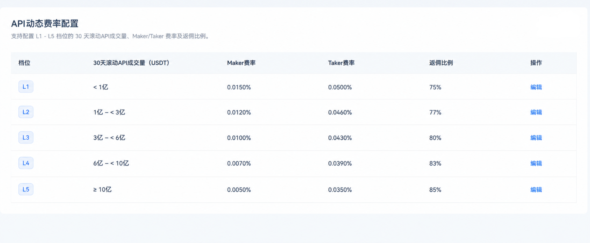
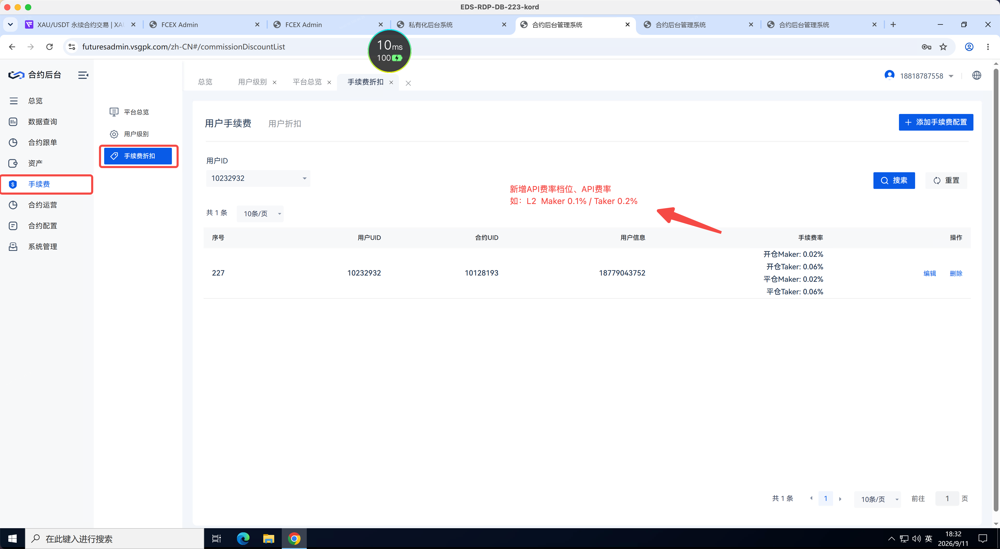

# PR-02208-1 前端范围与验收任务

> 本文件整理自需求负责人在会话中明确给出的合约后台两项前端功能及对应 PRD 原型/规则。完整 PRD 原文保留在 `lark-sync/prd-latest.extracted.md`，仅作背景参考；本次不实现其后端交易、统计、结算等内容。

## FE-1 合约配置：API动态费率及返佣

在「合约配置」下增加「API动态费率及返佣」列表页，布局参考原型及后台兄弟页面，优先复用已有表格、编辑表单、权限和提示组件。

列表固定展示 L1-L5 五档及字段：档位、30天滚动API成交量（USDT）、Maker费率、Taker费率、返佣比例、操作（编辑）。编辑可修改各档位成交量区间、Maker/Taker费率和返佣比例；档位名称固定，不提供给用户手动调整API档位的功能。

验收：
- L1-L5 均展示且不能重复；区间按左闭右开、最后一档左闭表示，档位成交量区间连续、无重叠、无空档。
- Maker/Taker 费率按现有系统精度规则校验；不合规则提示“请输入正确的参数”并阻止提交。
- 页面遵循现有合约后台权限流程（可见即可编辑）。编辑日志写入由既有/后端能力负责，前端不伪造日志。
- 表格和编辑态的数据以接口为准，不把原型示例费率/阈值硬编码为业务默认值。
- 编辑后费率配置在次日 UTC+8 00:00 生效；前端不重算历史成交或返佣。

原型：

完整约束见参考 PRD「管理后台配置API动态费率」。

## FE-2 手续费折扣：展示 API 费率档位与费率

在「手续费 > 手续费折扣」页面的结果/列表中增加「API费率档位」「API费率」两项；API费率同时展示 Maker 与 Taker 值，格式参考原型。无 API Key 用户两项展示 `-`。本期不提供手动调整 API 费率档位的功能。

验收：
- 两项字段在对应页面和列表中可见，并使用后端返回的档位及 Maker/Taker 费率。
- 无 API Key 时显示 `-`；不根据成交量、用户类型或其他字段在前端推导费率/档位。
- 展示复用当前页面的表格、文案及数值格式组件，不改变既有手续费折扣功能。

原型：

完整约束见参考 PRD「用户费率查询」。

## 边界与依赖

- 本次仅实现以上两个前端页面/展示点；API成交量统计、档位计算、费率结算、返佣计算、历史档位查询均不属于前端任务。
- 配置读取/保存、手续费折扣列表 API 必须提供对应契约和权限行为。契约缺失时列为依赖阻塞，不由前端拼接、推算或伪造。
