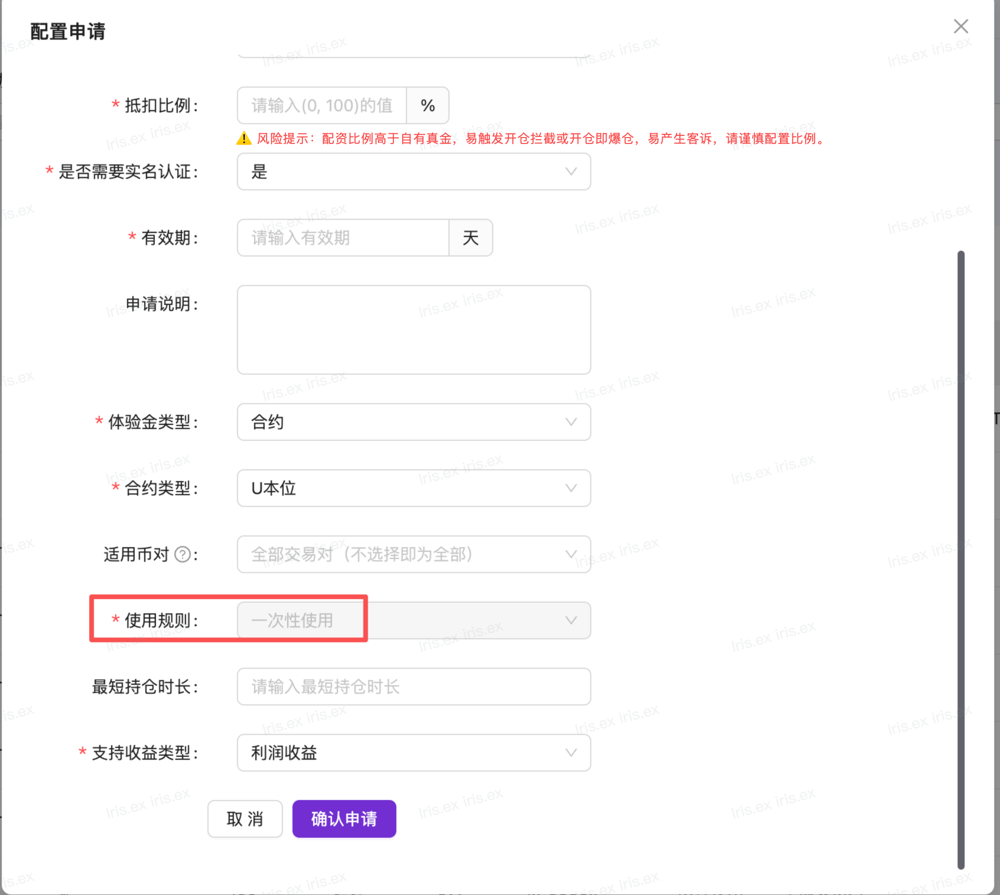

<title>【PR-02273】增强体验金改为保证金模式</title>

## 1. 前言

<callout emoji="📋">
**需求背景：**现有增强体验金设计，当仓位发生亏损、手续费或资金费时，优先扣除用户自有资金，自有资金不足的部分由增强体验金承担。
**现状痛点**：根据运营数据测算，在使用增强体验金仓位中，约52%的仓位亏损金额超过用户自有资金可承担金额，超出部分需由增强体验金承担，成为平台体验金成本的重要来源。
**本次改造目标**：参考竞品的保证金使用模式**，**增强体验金仅作为保证金参与开仓保证金不再作为交易结算资金。**不参与亏损/手续费/资金费的抵扣**，且不参与强平价计算，降低平台体验金成本。
</callout>

# 版本信息

<grid>
<column width-ratio="0.333333">
<callout emoji="⏰">
版本号：V1.0
</callout>
</column>
<column width-ratio="0.333333">
<callout emoji="📆">
创建日期 2026-08-10
</callout>
</column>
<column width-ratio="0.333333">
<callout emoji="👮">
审核人
</callout>
</column>
</grid>

# 变更日志

| **时间** | **版本号** | **变更人** | **主要变更内容** |
|-|-|-|-|
| 2026-08-11 |  | Iris | 创建文稿 |
|  |  |  |  |
|  |  |  |  |

# 评审记录

| 评审**时间** | 参与人员 | **结论** |
|-|-|-|
| 2026-08-12 | Iris | 评审，通过   https://qfglxo2m3dc.sg.larksuite.com/minutes/obsgdykjiq7h1nq9pj69311y?from=from_copylink |
| 2026-08-13 | Iris |  |
|  |  |  |

# 文档说明

## 基础业务标准

1、**增强体验金 业务规则优化**，涉及大数据组处理

2、福利中心侧相关统计查询的敏感信息脱敏展示

<cite doc-id="H9WsdHvwZoLWc0xVEg1lK0w7gsf" file-type="docx" title="业务-数据组上下游对照表" type="doc"></cite>

<cite doc-id="RpDxdh53HoacPrxjj9wlXa2ag5f" file-type="docx" title="PR-01268 【审计】手机/邮箱脱敏展示/加密传输" type="doc"></cite>

# 竞品分析

| **竞品** | **说明** |
|-|-|
| Deepcoin | 不可抵扣类型可用于开平仓合约交易，盈利可全部提取。   到期后，平台可能取消所有限价挂单，并在市价平仓后回收体验金。   体验金适用于任意币种交易和杠杆倍数，产生的盈利可划转和提现。   提现、划转或者到期后体验金将被回收。   https://www.deepcoin.com/ps/zh/helpcenter/article/22 |

# 文档说明

### 名词解释

| 术语 / 缩略词 | 说明 |
|-|-|
| 自有资金 | 用户充值、划转及交易盈利形成的合约账户资金，可用于保证金、亏损、手续费和资金费 |
| ~~增强体验金~~ | ~~平台发放的虚拟保证金权益卡券，用于合约交易的保证金，并不支持抵扣~~ |
| 保证金模式 | 是指增强体验金：仅可用于开平仓合约交易（作为保证金），不参与资金费/手续费/平仓亏损的抵扣；盈利可全部提取 |
| ~~已使用状态~~ | **~~该增强体验金曾实际用于开仓，并且当前已经结束使用、完成回收~~**~~，不是指体验金被亏损或费用消耗完。~~ |
| 已失效状态 | 直接到期回收或因划转、手动过期、系统失效而失效回收 |

# 需求范围

| 模块 | 本期支持内容 |
|-|-|
| 增强体验金 | 纯保证金不可抵扣 |
| 运营后台 | 使用规则，隐藏， 即，未到期前增强体验金都有效，可作为保证金开仓使用。 |
| 开仓 | 以增强体验金作为保证金参与开仓；开平仓全程不参与抵扣，其他规则不变（币对、杠杆） |
| 持仓管理 | 保证金率、预估强平价展示（**不含增强体验金余额，剔除处理**） |
| 平仓/结算 | 手动平仓、到期自动平仓、触发强平，ADL |
| 回收 | 划转、爆仓、到期、手动过期、手动失效 要 回收增强体验金 |
| 兼容 | 存量卡券、委托、仓位及旧版 APP 处理 |

非本需求范围：普通合约体验金（按比例抵扣，保持现状）

## 需求目标

- 将增强体验金统一调整为合约开仓保证金。
- 增强体验金不进入亏损及费用结算。
- 保证开仓额度、强平计算、资金结算和回收四类口径相互独立且可对账。
- 保证 C 端、运营后台、财务流水、风控及帮助中心规则一致。

# 功能详细说明

## 体验金总额 （改动）

= 可用体验金 + 使用中体验金；

使用中体验金包含委托冻结和开仓占用

可用体验金=总额-委托冻结和开仓占用

## **可用（改动） ：**

=可用真金+可用体验金

可用体验金=可用与开仓的= 增强体验金总额 - 委托冻结金额 - 开仓占用金额

## 交易结算与释放

手续费扣减金额 = 应付手续费，**仅扣自有资金**
应付资金费扣减金额 = max(应付资金费, 0)，**仅扣自有资金**
平仓亏损扣减金额 = max(-已实现盈亏, 0)，**仅扣自有资金**

增强体验金交易结算扣减金额 = 0

- 自有资金不足时不得自动改扣增强体验金，按照现有的风险控制流程处理（如阶梯减仓、爆仓、穿仓等）。

注：结算按比例释放体验金回可用的逻辑还在

## 预估强平价 / 实际爆仓价

**增强体验金不计入维持保证金能力，在计算预估强平价与实际爆仓价时，不计算增强体验金余额。**

- 预估强平价，**剔除增强体验金后的有效保证金/权益**计算；仅用现有预估强平公式中的用户自有资金相关项
- 实际爆仓价，同样**不纳入增强体验金余额**；仅用现有实际强平公式中的用户自有资金相关项
- 保证金率，"增强体验金"不计入总保证金；
- ~~维持保证金率，"增强体验金"不计入总保证金；~~

<table><colgroup><col/><col/><col/></colgroup><tbody><tr><td><b>计算项</b></td><td><b>当前公式</b></td><td><b>改造后公式</b></td></tr><tr><td><b>全仓仓位总保证金</b></td><td>现金余额＋增强体验金余额＋∑全仓未实现盈亏－∑其他仓位最低维持保证金占用</td><td>现金余额<del>＋增强体验金余额</del>＋∑全仓未实现盈亏－∑其他仓位最低维持保证金占用</td></tr><tr><td><b>页面展示保证金率</b></td><td>全仓维持保证金金额 ÷（现金余额＋增强体验金余额＋∑全仓未实现盈亏－∑其他仓位最低维持保证金占用－∑预计平仓手续费）</td><td>全仓维持保证金金额 ÷（现金余额<del>＋增强体验金余额</del>＋∑全仓未实现盈亏－∑其他仓位最低维持保证金占用－∑预计平仓手续费）</td></tr><tr><td><b>实际强平保证金率</b></td><td>（现金余额＋增强体验金余额＋∑全仓未实现盈亏－∑其他仓位最低维持保证金占用）÷∑全部全仓仓位标记价值</td><td>（现金余额<del>＋增强体验金余额</del>＋∑全仓未实现盈亏－∑其他仓位最低维持保证金占用）÷∑全部全仓仓位标记价值</td></tr><tr><td><b>实际强平条件</b></td><td>（现金余额＋增强体验金余额＋∑全仓未实现盈亏－∑其他仓位最低维持保证金占用）÷∑全部全仓仓位标记价值 ≤ 当前风险限额档位维持保证金率＋当前交易对平仓Taker费率</td><td>（现金余额<del>＋增强体验金余额</del>＋∑全仓未实现盈亏－∑其他仓位最低维持保证金占用）÷∑全部全仓仓位标记价值 ≤ 当前风险限额档位维持保证金率＋当前交易对平仓Taker费率</td></tr><tr><td><b>全仓单向预估强平价</b></td><td>（现金余额＋增强体验金余额－预计开仓手续费＋∑全仓未实现盈亏－标记价格×（当前多仓数量－当前空仓数量）－订单方向×预计成交价×订单数量－∑其他合约全仓仓位最低维持保证金占用）÷〔（当前档位维持保证金率＋当前交易对平仓Taker费率）×开仓后净仓位数量－（当前多仓数量－当前空仓数量＋订单方向×订单数量）〕</td><td>（现金余额<del>＋增强体验金余额</del>－预计开仓手续费＋∑全仓未实现盈亏－标记价格×（当前多仓数量－当前空仓数量）－订单方向×预计成交价×订单数量－∑其他合约全仓仓位最低维持保证金占用）÷〔（当前档位维持保证金率＋当前交易对平仓Taker费率）×开仓后净仓位数量－（当前多仓数量－当前空仓数量＋订单方向×订单数量）〕</td></tr><tr><td><b>实际爆仓价判断</b></td><td>当某一标记价格首次满足：（现金余额＋增强体验金余额＋该标记价格下的∑全仓未实现盈亏－该标记价格下的∑其他仓位最低维持保证金占用）÷该标记价格下的∑全部全仓仓位标记价值 ≤ 当前风险限额档位维持保证金率＋当前交易对平仓Taker费率，触发强平</td><td>当某一标记价格首次满足：（现金余额<del>＋增强体验金余额</del>＋该标记价格下的∑全仓未实现盈亏－该标记价格下的∑其他仓位最低维持保证金占用）÷该标记价格下的∑全部全仓仓位标记价值 ≤ 当前风险限额档位维持保证金率＋当前交易对平仓Taker费率，触发强平</td></tr><tr><td colspan="3">注： 改造后需<b>确保用的现金余额</b><b>，</b><b>不是</b><b>页面前端展示的那个</b><b>钱包余额</b><b>的值， 钱包余额里包含了体验金</b> 开仓及爆仓检验需测一下，这个检验里也需要把体验金去掉</td></tr></tbody></table>

### 附目前的公式

<cite doc-id="QadTw1Kj0iMwcwkiKiIlOFCfgxg" file-type="wiki" title="PR-01319 合约开仓页面增加“预估强平价”" type="doc"></cite>

<cite doc-id="ISnCwrLdqiSDllkfpUSlW4S8gOc" file-type="wiki" title="FA当前强平流程和问题整理" type="doc"></cite>

## 生命周期与状态

### 状态机改造

状态定义对照（改造前后）

<table><colgroup><col/><col/><col/><col/><col/></colgroup><tbody><tr><td><b>状态</b></td><td><b>改造前</b></td><td><b>改造后（增强体验金）</b></td><td><b>前端展示</b></td><td><b>按钮</b></td></tr><tr><td>待领取</td><td>待使用</td><td>卡券已发放，用户尚未领取</td><td>待使用</td><td>领取</td></tr><tr><td>使用中</td><td>使用中</td><td>用户领取成功，增强体验金进入合约账户，未过期</td><td>使用中</td><td>去交易</td></tr><tr><td>已使用（完）</td><td>按比例抵扣消耗完</td><td><del>开过仓（曾占用体验金），过期/到期时，只要开过仓 → 标记已使用完</del></td><td><del>已使用</del></td><td><del>已使用</del></td></tr><tr><td>已失效</td><td>过期/回收</td><td><del>领取过但从未开仓，</del>直接过期回收，操作：手动过期，系统回收、划转回收</td><td>已失效</td><td>已失效</td></tr><tr><td colspan="5">合约体验金的状态不变，还是改造前的状态</td></tr></tbody></table>

### 到期自动平仓（过期失效）（改造）

以服务器标准时间计算到期时间；达到到期/持仓时长后，系统自动发起市价平仓，取消所有限价挂单；平仓后完成结算、**回收增强体验金、**更新券状态；不影响用户真实资产。

#### 到期处理

- 无仓无单：立即回收全部增强体验金。
- 有委托或持仓：撤销相关委托，按规则市价平仓，释放冻结金额后回收。
- 回收增强体验金，但用户交易盈利正常划转至合约账户。
- 异常处理：撤单或平仓失败，保持待回收状态，持续重试并告警。

### 触发强平（改造）

达到强平阈值（剔除增强体验金后的风险率）时，增强体验金不参与计算，不抵扣亏损和费用，系统按市价结束仓位；**回收增强体验金**

### 划转失效

- 划转失效提示及逻辑不变，划转后会平仓/撤单+回收增强体验金
- 可提现、可划转金额不包含增强体验金本金。
- 异常处理：回收失败时，不得先执行划转。

### 手动过期

- 手动过期提示及逻辑不变，手动过期回收增强体验金

### 系统失效（改造）

- 管理后台，操作手动失效，处理同划转失效，回收增强体验金

## 极端场景：

配资50% 开100倍， 1% 就爆了，合约保证金小于维持保证金

客商保护：1、开进去就爆 会拦截； **测试验证该场景， 体验金也要去掉**

### **不回收的场景：**

<table><colgroup><col/><col/></colgroup><tbody><tr><td>场景</td><td>增强体验金处理</td></tr><tr><td>正常平仓，</td><td>到期前，<b>体验金按比例释放，可继续使用</b></td></tr><tr><td>ADL</td><td><b>ADL，</b>按平仓的比例释放占用，不回收增强体验金<cite type="user" user-id="ou_5ce1e622c15e12a75924305e7933724f" user-name="Wolf"></cite> <b><del>A按减仓比例释放占用，不回收增强体验金</del></b> （盈利减完 减亏损的）</td></tr><tr><td>阶梯减仓</td><td>按减仓比例释放占用，不回收增强体验金</td></tr></tbody></table>

# Web / App 页面设计

## 福利中心—增强体验金卡片

<table><colgroup><col/><col/><col/><col/></colgroup><tbody><tr><td>区域</td><td>字段/交互</td><td>展示规则</td><td>原型</td></tr><tr><td>主按钮</td><td>领取/ 去使用 /  已失效</td><td>不变， 去掉“已使用（使用完）”状态</td><td rowspan="2"></td></tr><tr><td>提示说明</td><td>可与自有资金一起作为合约保证金使用，盈利可全部提取。</td><td>详情弹窗展示完整</td></tr></tbody></table>

## 福利中心—合约增强体验金领取弹窗

<table><colgroup><col/><col/><col/></colgroup><tbody><tr><td>字段</td><td>规则</td><td>原型</td></tr><tr><td>文案说明</td><td>可与自有资金一起作为合约保证金使用，盈利可全部提取。</td><td></td></tr><tr><td>抵扣比例</td><td>改为配资比例</td><td></td></tr><tr><td>使用方式</td><td>删除，不展示</td><td></td></tr></tbody></table>

## 体验金详情弹窗

与按比例抵扣体验金区分 ，按比例抵扣体验金详情页不变， 仅增强体验金详情页改造

<table><colgroup><col/><col/><col/></colgroup><tbody><tr><td>字段</td><td>规则</td><td>原型</td></tr><tr><td>体验金名称</td><td>新增卡券类型【增强体验金】</td><td></td></tr><tr><td>已领取</td><td>已激活改为已领取</td><td rowspan="7">    </td></tr><tr><td>可用体验金</td><td>由 体验金余额 改为 可用体验金 =总额-使用中体验金</td></tr><tr><td>使用中体验金</td><td>已使用体验金改为 “使用中体验金”， 由抵扣消耗的体验金改为：开仓交易委托冻结和仓位占用的增强体验金 问题是：已使用 与 普通合约体验金的逻辑不一致</td></tr><tr><td>文案说明</td><td>可与自有资金一起作为合约保证金使用，盈利可全部提取。</td></tr><tr><td>使用规则</td><td>删除，不展示</td></tr><tr><td>配资比例</td><td>抵扣比例 改为 配资比例</td></tr><tr><td>按钮</td><td>隐藏查看使用详情按钮</td></tr></tbody></table>

## 体验金领取记录

<table><colgroup><col/><col/><col/></colgroup><thead><tr><th>字段</th><th>规则</th><th>原型</th></tr></thead><tbody><tr><td>使用规则</td><td>合约增强体验金，使用规则展示“--”</td><td></td></tr></tbody></table>

# 现货后台

## 体验金申请

<grid>
<column width-ratio="0.500000">

</column>
<column width-ratio="0.500000">
![The image shows a configuration application interface. Key elements include a "抵扣比例" (offset ratio) input field, a "是否需要实名认证" (real-name authentication required) dropdown set to "是" (yes), an "有效期" (expiration) input field, an "申请说明" (application description) text box, a "体验金类型" (experience gold type) dropdown set to "合约" (contract), a "合约类型" (contract type) dropdown set to "U本位" (U position), an "适用币对" (applicable trading pairs) dropdown, a "使用规则" (usage rules) dropdown set to "一次性使用" (one-time use), a "最短持仓时长" (minimum holding time) input field, and a "支持收益类型" (supported income type) dropdown set to "利润收益" (profit income). There are "取消" (cancel) and "确认申请" (confirm application) buttons at the bottom.](assets/img-006.png)

</column>
</grid>

- 体验金类型： 自有资金优先，改为 “不抵扣类型”，
- 配资比例：选择“不抵扣类型”时， 抵扣比例 展示为“配资比例”， 逻辑不变， 还是激活门槛的比例和 体验金与真金混合配资开仓的比例
- 风险提示文案：红色字体，静态文案，当选择不可口类型的增强体验金时，在配资比例字段下方展示：

  - ⚠️ 风险提示：配资比例高于自有真金，易触发开仓拦截或开仓即爆仓，易产生客诉，请谨慎配置比例。
- 使用规则：选择“不抵扣类型”时，隐藏使用规则

## 卡券领取记录

![The image shows a card voucher record interface. It has columns including UID, activity name, card code, card type, card status, original status, source, card name, source, currency, amount/ratio, used amount, remaining amount, due unused amount, usage times, status, original status, and issue time. There are search and reset buttons, and a "Export to csv" option. Below, there are three voucher records: one from "合约质押金" (margin) with USDT 50, another from "合约质押金300USDT" (margin) with USDT 300, and a third from "合约质押金" (margin) with USDT 50. The used amount column is highlighted in blue.](assets/img-008.png)

增强体验金：

- ~~已使用金额 = 当前正处于委托冻结或仓位占用中的增强体验金金额，会随撤单、开仓和平仓实时变化。~~
- 已使用金额 =0 。未产生实际消耗
- ~~剩余金额= 总-已使用金额~~
- 到期未使用金额= 体验金总额 ~~- 历史最大的开仓占用金额~~

## 卡券使用记录

![The image shows a card usage record interface in a system. It has a search bar with fields like UID, activity name, card code, etc., and a "Search" button. Below, there's a table with columns: Time, Card ID, Activity Name, Card Code, Card Name, Card Type, Business Type, Usage Scenario, Currency, Amount, and User Yield. The "Amount" column is highlighted in red, showing specific values such as 0.002, 0.0248, 0.0174, 0.00002. This relates to the context about card usage records where the amount is the effective historical maximum position occupied during the card's validity period.](assets/img-009.png)

 ~~金额= 卡券有效期内历史最大仓位占用金额~~

无使用记录

# 埋点

无

# 非功能性需求

帮助中心：修改指南，

新增风险提示，预估强平价与实际爆仓价不计算增强体验金余额

# 线上回滚方案

停增量、不动存量、只切开关、不重算账。

1. 运营后台停发新增强体验金
2. 存量卡券，已领取未开仓的失效处理
3. 已开仓位，视情况不强行平仓，让其自然到期/强平；新规则已产生的回收不回滚
4. 状态机，新状态字段保留在数据库，回滚=切换逻辑开关，不改存量状态数据，避免二次迁移风险

# 存量数据兼容

1、存量体验金，失效处理。补发

2、老版本app ，公告新规则

二、上线时存量增强体验金处理

<sheet sheet-id="2RqIBu" token="ZyNhs5EnZhVj4btmidnlNS4VgAh"></sheet>

原则：存量不追补、不重算，只对新开仓/新到期生效，避免上线即大面积状态突变。

# 验收准备

| 准备项 | 说明 |
|-|-|
| 测试账号 ×2 | 其一为普通账号；   其一用于验证划转/提现/回收路径 |
| 增强体验金 | 只做保证金开仓，确认不发生任何抵扣 |
| 释放校验 | 平仓后体验金释放回可用 |
| 到期触发 | 到期自动撤单、平仓、回收体验金 |
| 测试环境数据 | 可构造币价/行情的币对，便于触发强平阈值 |

核心验收用例

| 路径 | 用例 | 操作/预期 |
|-|-|-|
| 领取 | 领取入账 | 领取增强体验金后进入合约账户，卡券状态由“待领取”变为“使用中” |
| 开仓 | 保证金开仓 | 使用增强体验金成功开仓；体验金总额不变，可用金额减少 |
| 开仓 | 金额口径 | 体验金总额 = 可用体验金 + 使用中体验金；使用中体验金包含委托冻结和开仓占用 |
| 结算 | 不参与交易结算 | 手续费、资金费及交易亏损仅从自有资金结算，不减少增强体验金总额 |
| 平仓 | 释放体验金 | 撤单或平仓后，对应冻结/占用金额释放回可用体验金，可继续用于开仓 |
| 平仓 | 盈利入账 | 平仓盈利正常计入用户自有资金，可提现、可划转金额不包含体验金本金 |
| 强平 | 不参与强平计算 | 预估强平价和实际强平价均不包含增强体验金；前端展示与实际触发口径一致 |
| 强平 | 强平回收 | 用户触发强平后，完成平仓及占用释放，再回收增强体验金，体验金已实际参与过开仓，卡券状态更新为“已使用” |
| ADL/阶梯减仓 | 释放但不回收 | 按实际减仓数量释放体验金占用；未进入爆仓终态时不回收，卡券保持“使用中” |
| 已使用 | 已使用状态 | 体验金实际参与过开仓，之后因强平、到期、划转、激活第二张或后台操作被回收 |
| 已失效 | 已失效状态 | 体验金从未参与开仓，直接到期回收或因划转、手动过期、系统失效、被回收 |
| 到期 | 到期无仓无单 | 到期后直接回收增强体验金，卡券变为“已失效” |
| 到期 | 到期有仓有单 | 系统撤销委托、市价平仓，释放全部占用后回收体验金；盈利保留在自有资金中 |
| 划转 | 回收校验 | 失效提示弹窗 |
| 状态 | 状态流转 | 已使用 和 已失效的走新的逻辑 |
| 页面 | C端详情 | 展示体验金总额、可用体验金、使用中体验金及失效时间，抵扣比例改为配资比例   不跳转使用记录 |
| 兼容 | 普通体验金回归 | 普通体验金的卡片、状态、抵扣及结算逻辑不受本需求影响 |
